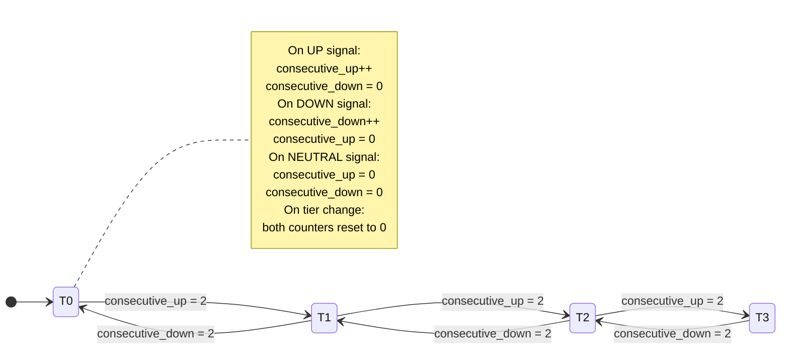
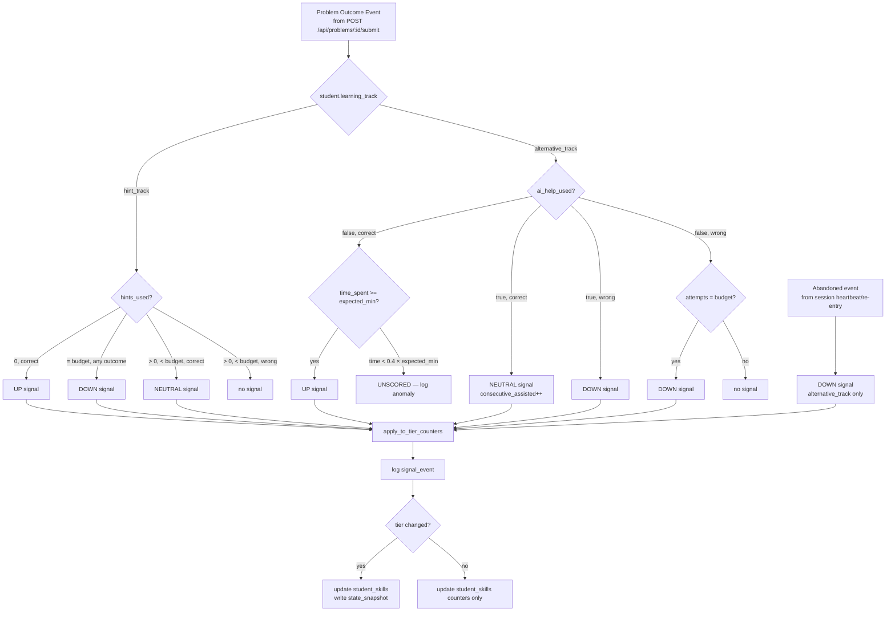
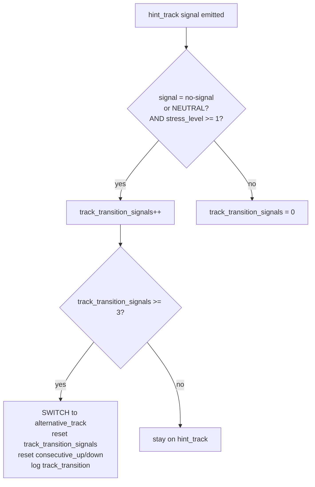
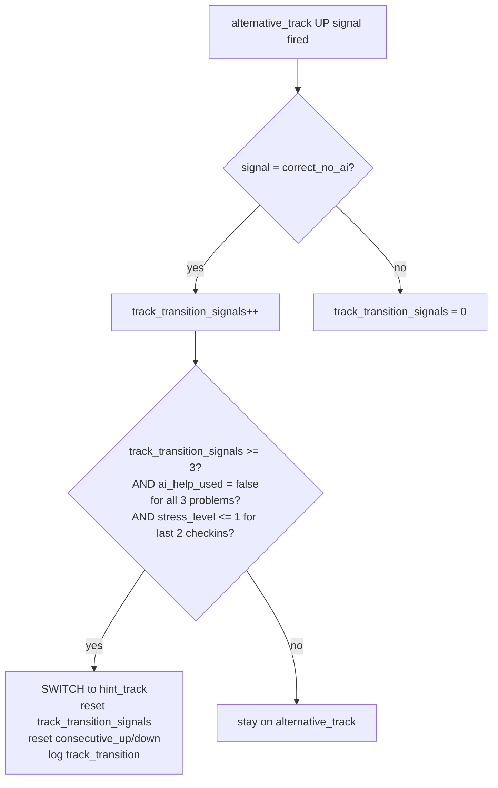

# Adaptive Skill Assessment: Multi-Profile Signal Design

## 1. The Core Problem, Restated

The existing `skill-updater.ts` has three signal cases:

| Raw Event | Direction |
|-----------|-----------|
| correct, 0 hints | UP |
| hint budget exhausted | DOWN |
| correct, hints used | NEUTRAL (reset) |

This works when students engage with hints. For students who avoid hints entirely, neither UP nor DOWN ever fires cleanly:
- No hint use → no `hint_budget_exhausted` → no DOWN signal
- Correct (possibly via external AI) → `correct_no_hints` fires → spurious UP signal

The fix is a **signal interpretation layer** between raw events and the counter state machine. The state machine itself stays identical; only what feeds into it changes by learning track.

---

## 2. Simplifying "Three Profiles" to Two Tracks

"Advanced" students (tier=3, strategic hint use) are **already handled correctly**. They rarely exhaust hint budgets, so they rarely get DOWN signals. They get UP signals naturally. No changes needed.

The real split is behavioral:

| Track | Who | Signal source |
|-------|-----|--------------|
| `hint_track` | Normal + Advanced | Hint interactions (existing) |
| `alternative_track` | Struggling/Anxious | Attempt outcomes + AI-help events |

A student can switch tracks. Track is per-student (anxiety is holistic, not topic-specific). Tier remains per-topic (knowledge is topic-specific).

---

## 3. Signal Taxonomy

### Hint Track (existing — no changes)

| Signal | Condition | Direction |
|--------|-----------|-----------|
| `correct_no_hints` | correct AND hints_used = 0 | UP |
| `hint_budget_exhausted` | hints_used >= hint_budget | DOWN |
| `correct_with_hints` | correct AND 0 < hints_used < budget | NEUTRAL |
| `incorrect_budget_remaining` | wrong AND budget not exhausted | (none) |

### Alternative Track (new)

| Signal | Condition | Direction |
|--------|-----------|-----------|
| `correct_no_ai` | correct AND ai_help_used = false AND time_spent >= expected_min_time_s | UP |
| `suspicious_fast` | correct AND time_spent < expected_min_time_s × 0.4 | UNSCORED |
| `assisted_correct` | correct AND ai_help_used = true | NEUTRAL |
| `attempts_exhausted` | wrong AND attempts_used >= attempt_budget | DOWN |
| `abandoned` | left problem without submitting | DOWN |
| `ai_help_still_wrong` | ai_help_used AND subsequent attempt wrong | DOWN |

**The `attempt_budget` column**: `adaptive_config.hint_budget` is repurposed. For `alternative_track` students it means maximum attempts before a DOWN signal (default: 5, vs 3 hints for hint_track). Same DB column, different semantic layer.

### Forced Verification (anti-gaming circuit breaker)

When `consecutive_assisted >= 5` on any topic, the next 2 problems on that topic enter **forced verification mode**: the AI-help button is locked. This is transparent to the student ("Let's see what you can do on your own"). Outcome:
- 1 correct in forced mode → clear `consecutive_assisted`, emit 1 UP signal
- 0 correct in forced mode → emit 1 DOWN signal

---

## 4. Unified State Machine

The counter architecture is identical for both tracks. The tier machine only sees direction, never signal type.



The `consecutive_up` / `consecutive_down` counters in `student_skills` work the same regardless of which track produced the signal.

---

## 5. Signal Interpretation Pipeline



---

## 6. Track Transition Logic

Track is detected from behavioral signals accumulated **across problems** (not within a single problem).

### HINT_TRACK → ALTERNATIVE_TRACK



**Trigger condition** (all three required):
1. 3 consecutive problems where the student submitted no hint requests AND (wrong OR abandoned)
2. `stress_level >= 1` during that window
3. OR: 2 consecutive problems where AI-help was clicked before any hint was used (fast escape to AI)

**Rationale for the stress gate**: A student who skips hints and solves correctly (tier=3 Advanced behavior) should NOT be classified as struggling. The stress gate distinguishes "confident, doesn't need hints" from "anxious, avoids hints."

### ALTERNATIVE_TRACK → HINT_TRACK



**Asymmetric threshold (3 back vs. 3 forward)**: Both directions use 3 signals, but the ALTERNATIVE→HINT switch has an additional stress guard (must see `stress_level <= 1` in recent checkins). Switching a student back to hint_track when they're still anxious risks re-triggering the freeze pattern. The stress guard costs at most one extra checkin cycle — low cost, high safety.

---

## 7. Data Model

### Schema additions

```sql
-- students: track state (per-student, not per-topic)
ALTER TABLE students
  ADD COLUMN learning_track TEXT NOT NULL DEFAULT 'hint_track'
    CHECK (learning_track IN ('hint_track', 'alternative_track')),
  ADD COLUMN track_transition_signals INT NOT NULL DEFAULT 0;

-- student_skills: AI-assisted streak (per-topic, for gaming detection)
ALTER TABLE student_skills
  ADD COLUMN consecutive_assisted INT NOT NULL DEFAULT 0;
  -- resets to 0 on any real UP or DOWN signal
  -- at 5 -> forced verification mode on next problem for this topic

-- problems: time gate for alternative_track scoring
ALTER TABLE problems
  ADD COLUMN expected_min_time_s INT NOT NULL DEFAULT 60;
  -- set at import time: easy=60, medium=120, hard=240

-- signal_events: append-only log of every scored assessment signal
CREATE TABLE signal_events (
  id              UUID        PRIMARY KEY DEFAULT gen_random_uuid(),
  student_id      UUID        NOT NULL REFERENCES students(id),
  session_id      UUID        NOT NULL REFERENCES sessions(id),
  problem_id      UUID        NOT NULL REFERENCES problems(id),
  topic           TEXT        NOT NULL,
  learning_track  TEXT        NOT NULL,
  signal_type     TEXT        NOT NULL,
  direction       TEXT        NOT NULL
    CHECK (direction IN ('up', 'down', 'neutral', 'unscored')),
  tier_before     INT         NOT NULL,
  tier_after      INT         NOT NULL,
  metadata        JSONB,
  -- metadata includes: time_spent_s, ai_help_used, hints_used,
  --   attempts_used, confidence_reported, consecutive_up_after, consecutive_down_after
  created_at      TIMESTAMPTZ NOT NULL DEFAULT now()
);

-- track_transitions: append-only audit log of track changes
CREATE TABLE track_transitions (
  id                     UUID        PRIMARY KEY DEFAULT gen_random_uuid(),
  student_id             UUID        NOT NULL REFERENCES students(id),
  from_track             TEXT        NOT NULL,
  to_track               TEXT        NOT NULL,
  trigger_signal_ids     UUID[]      NOT NULL,  -- last 3 signal_events that caused switch
  stress_level_at_switch INT,
  created_at             TIMESTAMPTZ NOT NULL DEFAULT now()
);
```

### Updated TypeScript types

```typescript
// src/types/schema.ts additions

export type LearningTrack = 'hint_track' | 'alternative_track';

export type SignalType =
  // hint_track
  | 'correct_no_hints'
  | 'hint_budget_exhausted'
  | 'correct_with_hints'
  // alternative_track
  | 'correct_no_ai'
  | 'suspicious_fast'       // unscored, logged for review
  | 'assisted_correct'
  | 'attempts_exhausted'
  | 'abandoned'
  | 'ai_help_still_wrong'
  // cross-track (forced verification)
  | 'forced_verification_pass'
  | 'forced_verification_fail';

export type SignalDirection = 'up' | 'down' | 'neutral' | 'unscored';

export interface ScoredSignal {
  type: SignalType;
  direction: SignalDirection;
  topic: string;
  metadata: {
    time_spent_s: number;
    ai_help_used: boolean;
    hints_used: number;
    attempts_used: number;
    confidence_reported?: 1 | 2 | 3;   // post-answer self-report if collected
  };
}

// Extended StudentSkill (add to existing interface)
export interface StudentSkill {
  // ...existing fields...
  consecutive_assisted: number;        // resets on UP/DOWN; at 5 -> forced verification
}

// Extended Student (add to existing interface)
export interface Student {
  // ...existing fields...
  learning_track: LearningTrack;
  track_transition_signals: number;    // 0-3, toward next track switch
}

export interface SignalEvent {
  id: string;
  student_id: string;
  session_id: string;
  problem_id: string;
  topic: string;
  learning_track: LearningTrack;
  signal_type: SignalType;
  direction: SignalDirection;
  tier_before: number;
  tier_after: number;
  metadata: Record<string, unknown>;
  created_at: Date;
}

export interface TrackTransition {
  id: string;
  student_id: string;
  from_track: LearningTrack;
  to_track: LearningTrack;
  trigger_signal_ids: string[];
  stress_level_at_switch: number | null;
  created_at: Date;
}
```

---

## 8. Core Engine Pseudocode

### 8a. Signal interpretation

```typescript
// src/services/skill-updater.ts  (replaces and extends existing file)

interface ProblemOutcome {
  studentId: string;
  sessionId: string;
  topic: Topic;
  correct: boolean;
  hintsUsed: number;
  hintBudgetExhausted: boolean;
  aiHelpUsed: boolean;
  attemptsUsed: number;
  timeSpentS: number;
  expectedMinTimeS: number;
  attemptBudget: number;       // = adaptive_config.hint_budget for alt_track
  learningTrack: LearningTrack;
}

function interpretSignal(outcome: ProblemOutcome): ScoredSignal | null {
  const meta = {
    time_spent_s: outcome.timeSpentS,
    ai_help_used: outcome.aiHelpUsed,
    hints_used: outcome.hintsUsed,
    attempts_used: outcome.attemptsUsed,
  };

  if (outcome.learningTrack === 'hint_track') {
    if (outcome.correct && outcome.hintsUsed === 0) {
      return { type: 'correct_no_hints', direction: 'up', topic: outcome.topic, metadata: meta };
    }
    if (outcome.hintBudgetExhausted) {
      return { type: 'hint_budget_exhausted', direction: 'down', topic: outcome.topic, metadata: meta };
    }
    if (outcome.correct && outcome.hintsUsed > 0) {
      return { type: 'correct_with_hints', direction: 'neutral', topic: outcome.topic, metadata: meta };
    }
    return null;   // incorrect, budget remaining — no signal
  }

  // alternative_track
  if (outcome.correct) {
    if (!outcome.aiHelpUsed) {
      if (outcome.timeSpentS < outcome.expectedMinTimeS * 0.4) {
        return { type: 'suspicious_fast', direction: 'unscored', topic: outcome.topic, metadata: meta };
      }
      return { type: 'correct_no_ai', direction: 'up', topic: outcome.topic, metadata: meta };
    }
    return { type: 'assisted_correct', direction: 'neutral', topic: outcome.topic, metadata: meta };
  }

  // incorrect
  if (outcome.aiHelpUsed) {
    return { type: 'ai_help_still_wrong', direction: 'down', topic: outcome.topic, metadata: meta };
  }
  if (outcome.attemptsUsed >= outcome.attemptBudget) {
    return { type: 'attempts_exhausted', direction: 'down', topic: outcome.topic, metadata: meta };
  }
  return null;   // wrong, attempts remaining — no signal
}

// Called from session heartbeat or re-entry when prior problem had no submission
function interpretAbandon(topic: Topic, track: LearningTrack): ScoredSignal | null {
  if (track !== 'alternative_track') return null;
  return {
    type: 'abandoned',
    direction: 'down',
    topic,
    metadata: { time_spent_s: 0, ai_help_used: false, hints_used: 0, attempts_used: 0 },
  };
}
```

### 8b. Counter management

```typescript
async function applySignalToCounters(
  studentId: string,
  topic: string,
  signal: ScoredSignal,
): Promise<{ tierChanged: boolean; tierBefore: number; tierAfter: number }> {
  const row = await pool.query(
    `SELECT tier, consecutive_up, consecutive_down, consecutive_assisted
       FROM student_skills WHERE student_id=$1 AND topic=$2`,
    [studentId, topic],
  );
  if (row.rows.length === 0) return { tierChanged: false, tierBefore: 0, tierAfter: 0 };

  let { tier, consecutive_up, consecutive_down, consecutive_assisted } = row.rows[0];
  const tierBefore = tier;

  if (signal.direction === 'unscored') {
    await logSignalEvent(studentId, signal, tier, tier);
    return { tierChanged: false, tierBefore: tier, tierAfter: tier };
  }

  if (signal.direction === 'up') {
    consecutive_up += 1;
    consecutive_down = 0;
    consecutive_assisted = 0;
    if (consecutive_up >= 2) {
      tier = Math.min(3, tier + 1);
      consecutive_up = 0;
    }
  } else if (signal.direction === 'down') {
    consecutive_down += 1;
    consecutive_up = 0;
    consecutive_assisted = 0;
    if (consecutive_down >= 2) {
      tier = Math.max(0, tier - 1);
      consecutive_down = 0;
    }
  } else {
    // neutral
    if (signal.type === 'assisted_correct') {
      consecutive_assisted += 1;
      // do NOT reset up/down counters — neutrality means "doesn't count either way"
    } else {
      // correct_with_hints on hint_track: reset both counters
      consecutive_up = 0;
      consecutive_down = 0;
      consecutive_assisted = 0;
    }
  }

  await pool.query(
    `UPDATE student_skills
        SET tier=$1, consecutive_up=$2, consecutive_down=$3,
            consecutive_assisted=$4, updated_at=now()
      WHERE student_id=$5 AND topic=$6`,
    [tier, consecutive_up, consecutive_down, consecutive_assisted, studentId, topic],
  );

  await logSignalEvent(studentId, signal, tierBefore, tier);

  return { tierChanged: tier !== tierBefore, tierBefore, tierAfter: tier };
}
```

### 8c. Track transition evaluation

```typescript
async function evaluateTrackTransition(
  studentId: string,
  signal: ScoredSignal | null,
  stressLevel: number,
): Promise<void> {
  const student = await getStudent(studentId);
  const { learning_track, track_transition_signals } = student;

  if (learning_track === 'hint_track') {
    // null signal + stress >= 1 means: avoided hints, got no result, under stress
    const shouldCount = signal === null && stressLevel >= 1;
    const newCount = shouldCount ? track_transition_signals + 1 : 0;
    await updateTrackTransitionSignals(studentId, newCount);

    if (newCount >= 3) {
      await switchTrack(studentId, 'hint_track', 'alternative_track', stressLevel);
    }
  } else {
    // alternative_track: count genuine unaided correct signals while calm
    const shouldCount =
      signal?.type === 'correct_no_ai' &&
      !signal.metadata.ai_help_used &&
      stressLevel <= 1;
    const newCount = shouldCount ? track_transition_signals + 1 : 0;
    await updateTrackTransitionSignals(studentId, newCount);

    if (newCount >= 3) {
      await switchTrack(studentId, 'alternative_track', 'hint_track', stressLevel);
    }
  }
}

async function switchTrack(
  studentId: string,
  fromTrack: LearningTrack,
  toTrack: LearningTrack,
  stressLevel: number,
): Promise<void> {
  const recentSignals = await getRecentSignalEventIds(studentId, 3);

  await pool.query(
    `UPDATE students SET learning_track=$1, track_transition_signals=0 WHERE id=$2`,
    [toTrack, studentId],
  );
  // Reset per-topic counters so prior-track debt doesn't poison the new track
  await pool.query(
    `UPDATE student_skills
        SET consecutive_up=0, consecutive_down=0, consecutive_assisted=0
      WHERE student_id=$1`,
    [studentId],
  );

  await pool.query(
    `INSERT INTO track_transitions
       (student_id, from_track, to_track, trigger_signal_ids, stress_level_at_switch)
       VALUES ($1, $2, $3, $4, $5)`,
    [studentId, fromTrack, toTrack, recentSignals, stressLevel],
  );
}
```

### 8d. Forced verification trigger

```typescript
async function checkForcedVerification(
  studentId: string,
  topic: string,
): Promise<boolean> {
  const row = await pool.query(
    `SELECT consecutive_assisted FROM student_skills WHERE student_id=$1 AND topic=$2`,
    [studentId, topic],
  );
  if (row.rows.length === 0) return false;
  return row.rows[0].consecutive_assisted >= 5;
}

// Called from problem fetch (GET /api/problems/next).
// If true, the problem response includes forced_verification: true,
// which tells the client to lock the AI-help button for this problem.
```

### 8e. Wiring into POST /api/problems/:id/submit (summary)

```typescript
// 1. Classify outcome into ScoredSignal via interpretSignal()
// 2. Apply to counters via applySignalToCounters()
// 3. Evaluate track transition via evaluateTrackTransition()
// 4. Check forced verification status via checkForcedVerification()
// 5. Return updated tier + any intervention trigger to client
```

---

## 9. Edge Case Analysis

### "AI help → correct — upgrade, neutral, or downgrade?"

**Neutral.** The student may have learned something, or may have copied. We can't distinguish. Crediting it as UP lets students inflate tier. Crediting as DOWN punishes legitimate learning. Neutral is the only honest answer.

The counter stays frozen on ASSISTED_CORRECT. If the student only ever uses AI, their tier stays fixed — which accurately reflects that they need AI support at their current tier. They can unlock upgrades only through unaided correct answers.

### "What if a student improves but stays on alternative_track forever?"

The track back to `hint_track` requires 3 consecutive `correct_no_ai` with stress <= 1. A genuinely improving student will naturally generate these signals as their confidence grows. The system doesn't force them back early (which would risk re-triggering freeze), but the path is clear.

### "Can a student game by always clicking AI to avoid tier increases?"

After 5 consecutive ASSISTED_CORRECT on a topic → forced verification. Two problems without AI access. The student either demonstrates competence (UP signal, clears streak) or fails (DOWN signal). This caps the maximum "parking" time at ~5 problems per topic before forced assessment.

### "What if a hint_track student happens to skip hints on a hard problem and gets it wrong — false track-switch trigger?"

The transition requires 3 consecutive such problems AND stress_level >= 1. One hard problem where a confident student tried without hints and got it wrong doesn't trigger the switch. The stress gate is essential — a confident student who skips hints and fails has stress_level = 0 or 1 max; a genuinely struggling student has stress_level >= 1 consistently.

### "Can a struggling student be at tier-3?"

Yes. Track and tier are orthogonal. A tier-3 student can be on alternative_track (high competence, high anxiety). Their AI assistance is scaffolding for confidence, not competence. Their UP signals come from `correct_no_ai` — they CAN solve without AI, they just freeze if not given the escape hatch option. The system respects this.

### "What does hint_depth_preference mean for alternative_track students?"

During any auto-delivered hint (e.g., idle trigger), it still governs tone. Default it to `'concrete'` on track switch to `alternative_track` — anxious students want direct structure, not Socratic questioning.

### "Tier-0 stuck forever on alternative_track?"

Tier-0 means foundational gaps. DOWN signals from tier-0 are clamped at 0 (handled by `Math.max(0, tier - 1)`). The student stays at tier-0, which correctly triggers more scaffolding (lower difficulty problems, more AI support). This is the intended floor behavior.

---

## 10. Anti-Gaming Summary

| Gaming Vector | Defense |
|---------------|---------|
| Click AI always → never tier up | Forced verification at `consecutive_assisted = 5` |
| Click AI always → never tier down | NEUTRAL signal doesn't prevent DOWN from subsequent genuine failure |
| Submit answer instantly (already knew it) | `suspicious_fast` gate: unscored if time < 40% of expected minimum |
| Fake anxiety to stay in low tier | ASSISTED_CORRECT is neutral, not negative — no benefit to staying low |
| Abandon problems to avoid DOWN signal | `abandoned` → DOWN signal for alternative_track |
| Self-report always high confidence | `self_report_weight` decay already in `cognitive-state.ts`; confidence reports are one data point, not gating |

---

## 11. Integration Points

| File | Change |
|------|--------|
| `src/services/skill-updater.ts` | Replace `SkillUpdateInput` with `ProblemOutcome`; add `interpretSignal()`, `evaluateTrackTransition()`, `checkForcedVerification()` |
| `src/types/schema.ts` | Add `LearningTrack`, `SignalType`, `SignalDirection`, `ScoredSignal`, `SignalEvent`, `TrackTransition`; extend `Student` and `StudentSkill` |
| `src/api/problems/handler.ts` | Pass `learningTrack`, `aiHelpUsed`, `attemptsUsed`, `timeSpentS` into signal interpreter; check `checkForcedVerification()` on problem fetch |
| `schema.sql` | Add columns to `students`, `student_skills`, `problems`; add `signal_events`, `track_transitions` tables |
| `src/services/adaptive-engine.ts` | Add `ai_help_invoked` trigger type; route based on `learning_track` when computing thresholds |

---

## 12. Design Decision Log

**Why not a third "struggling" track separate from hint/alternative?** Cognitive simplicity — two tracks cover the behavioral split. "Advanced" is a tier outcome, not a behavioral track. Adding a third track adds branching without new capability.

**Why reset consecutive counters on track switch?** Counter "debt" from the old track is meaningless in the new track. A student switching to alternative_track with `consecutive_down = 1` (from hint track) would be halfway to a tier drop from a hint-based signal — that's incoherent in the new context.

**Why is the stress gate required for HINT→ALTERNATIVE switch but not ALTERNATIVE→HINT?** A confident student who doesn't need hints has no stress signal. A recovering anxious student who's beginning to solve without AI does need the stress gate to confirm recovery isn't just a good day. Asymmetry follows from the asymmetric risk: false-positive struggling classification costs one track of signal collection; false-positive recovery classification could re-trigger the freeze pattern.

**Why store `expected_min_time_s` on the problems table, not derive it from difficulty?** It makes the time gate auditable and overrideable per-problem. Some hard problems are fast to solve if you know the right approach; some easy problems have long setups. Problem-specific values beat inferred ones here.
